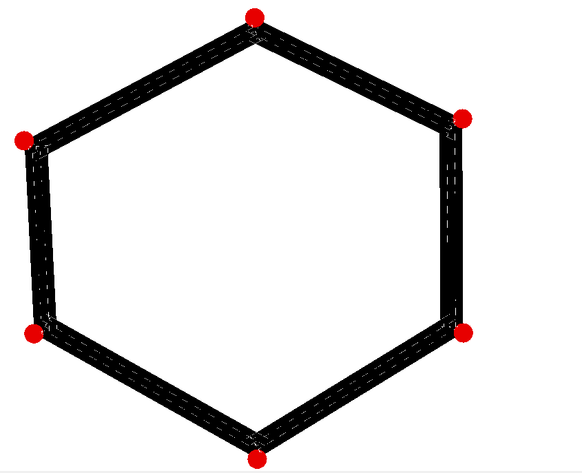
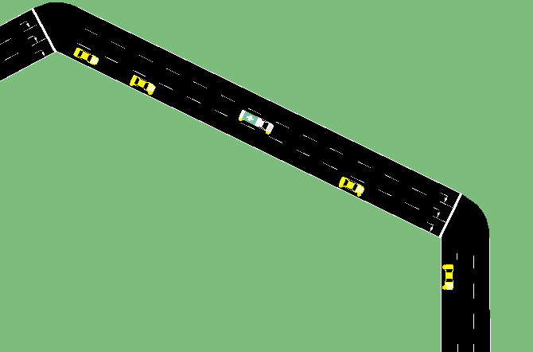
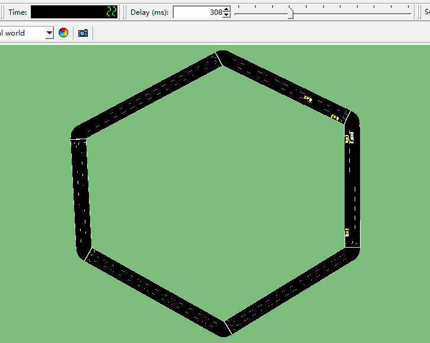
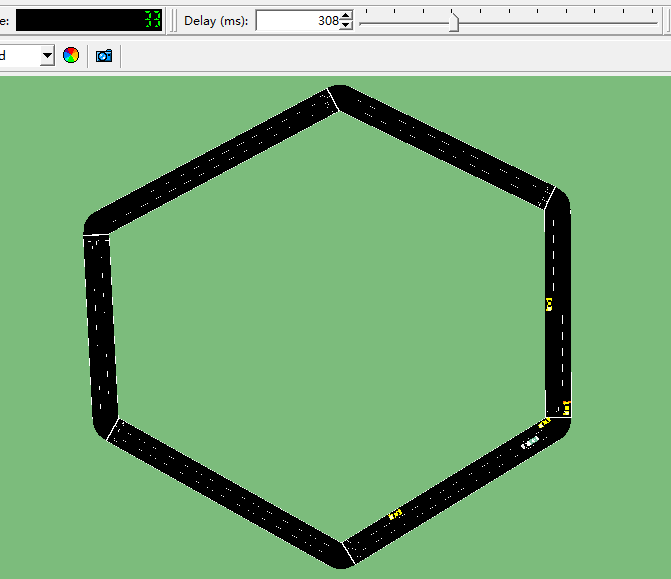
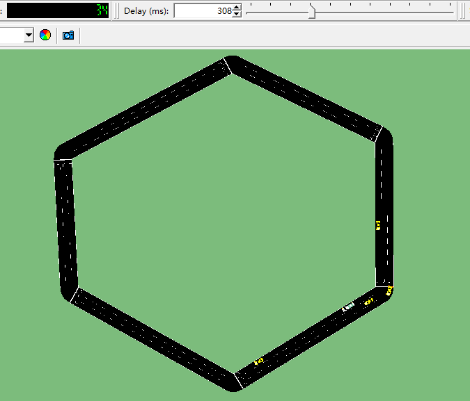
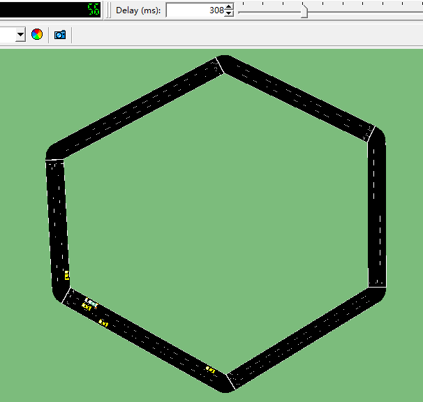
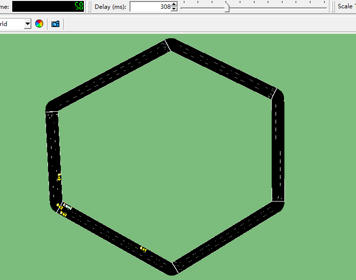

### [Terminology](https://sumo.dlr.de/docs/Simulation/Output/Lane-_or_Edge-based_Traffic_Measures.html#value_descriptions) 
- `occupancy`: Occupancy of the edge/lane in %. A value of 100 would indicate vehicles standing bumper to bumper on the whole edge (minGap=0).
- `density`: Vehicle density on the edge.
- `laneDensity`: Vehicle density on the edge per lane
- `travelTime`: Time needed to pass the edge/lane, note that this is just an estimation based on the mean speed, not the exact time the vehicles needed.
- `overlapTravelTime`: Time needed to pass the edge/lane completely, note that this is just an estimation based on the mean speed, not the exact time the vehicles needed.
- `sampledSeconds`: The number of vehicles that are present on the edge/lane in each second summed up over the measurement interval.
- `speed`: The mean speed on the edge/lane within the reported interval.
- `speedRelative`: quotient of mean speed value (see above) and the lane speed limit.
- `timeLoss`: The total number of seconds vehicles lost due to driving slower than desired (summed up over all vehicles).

### Explanation
- Route: Route from joint j1 to j1, traversing e1 to e6.

- Vehicle types:
    - Controlled vehicles: Length set to 5, accel set to 3.5, decel set to 2.2, maxSpeed set to 10. Their ids are "0", "1", "2", "3", and they leave joint j1 at time frame "0", "3", "9", "12" separately.
    - Experiment vehicle: Identical to controlled vehicles except its length is set to 7, its guiShape as an ambulance. It departs at time frame "6" with id as "test". "test" would be experimented with acceleration, multiple stops, and lane change.


### Tests
- Original: Run by sumo by default. Note there are serveral critical time frames:
    - "22": "test" is about to take over "1"

    - "33"~"34": "test" is about to change from lane 1 to lane 0 on edge e3.


    - "56": "1" is about to take over "test"

    - "58": "2" is about to take over "test"

- Acc: 
    - "22": Set the acceleration of "test" to 5.0 to take over "1" faster.
    - "33": Set the acceleration of "test" to -5.0 to slow down.
    - "58": Set the acceleration of "test" back to 5.0.
```python
# corresponding code
def run():
    step = 0
    while traci.simulation.getMinExpectedNumber() > 0:
        traci.simulationStep()
        if 'test' in traci.vehicle.getIDList():
            if step == 22:
                traci.vehicle.setAcceleration("test",5.0,13)
            if step == 33:
                traci.vehicle.setAcceleration("test", -5.0, 23)
            if step == 58:
                traci.vehicle.setAcceleration("test", 5.0, 13)
        step += 1
    traci.close()
```
- Stop:
    - "22": Set "test" to immediate stop.
    - "25": Give the control back to sumo.
    - "33": Immediate stop.
    - "36": Sumo back in control.
    - "56": Immediate stop.
    - "59": Sumo back in control.
```python
# corresponding code
def run():
    step = 0
    while traci.simulation.getMinExpectedNumber() > 0:
        traci.simulationStep()
        if 'test' in traci.vehicle.getIDList():
            if step == 22:
                traci.vehicle.setSpeed("test", 0)
            if step == 25:
                traci.vehicle.setSpeed("test", -1)
            if step == 33:
                traci.vehicle.setSpeed("test", 0)
            if step == 36:
                traci.vehicle.setSpeed("test", -1)
            if step == 56:
                traci.vehicle.setSpeed("test", 0)
            if step == 59:
                traci.vehicle.setSpeed("test", -1)
        step += 1
    traci.close()
```
- LaneChange:
  - "35": Change "test" back to lane 0 of edge 3 (originally lane 1)
  - "55": Change "test" to lane 1 of edge 5 (originally lane 0)
```python
# corresponding code
def run():
    step = 0
    while traci.simulation.getMinExpectedNumber() > 0:
        traci.simulationStep()
        if 'test' in traci.vehicle.getIDList():
            if step == 35:
                traci.vehicle.changeLane("test", 0, 20)
            if step == 55:
                traci.vehicle.changeLane("test", 1, 20)
        step += 1
    traci.close()
```

### Result

#### [Acc](./Acc/edgeOutput.xml)

- At time frame "22" when "test" raises its acceleration, "test" is on edge e2. We could see that edge e2's edge `density` slightly increased from 8.49 to 8.72, this is probably because the acceleration of "test" affected the controlled vehicles' behaviors that they lingered on e2. `speed` on the other hand increased as "test" is accelerating, thus `travelTime` and `timeLoss` decreases.
- At time frame "33" where "test" is slowing down as its acceleration is negative, "test" is on e3. We could see that `speed` is actually increasing, this may be due to the deacceleration allows other controlled vehicles to proceed without the constraint of "test".
- At time frame "58" when "test" is on edge e4, we could see that `sampledSeconds` increases, while `speed` decreases, indicating the vehicles are lingering on e4.


#### [Stop](./Stop/edgeOutput.xml)

- At time frame "22" to "33", where "test" is forced to stop, "test" is on e2. `Density`,   `sampledSeconds`, `timeLoss` and `travelTime` increases, while `speed` decreases.
- Similar phenomena could be observed from "33" to "36" and "56" to "59".


#### [LaneChange](./LaneChange/edgeOutput.xml)
- At time "35", "test" is on e3. We could see that multiple lane changes of "test" barely influence the measurements. `Density` decreased from 2.67 to 2.65, `occupancy` decreased from 1.33 to 1.31, which are quite trival, while `sampledSeconds`, `speed` and `travelTime` stay the same.
- At time "55", similar results are seen. 
